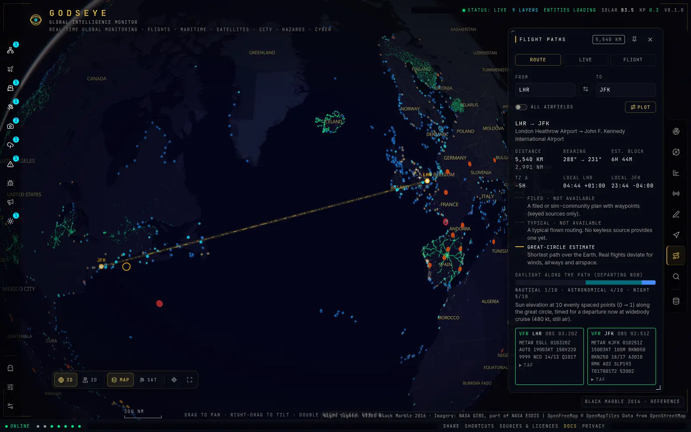
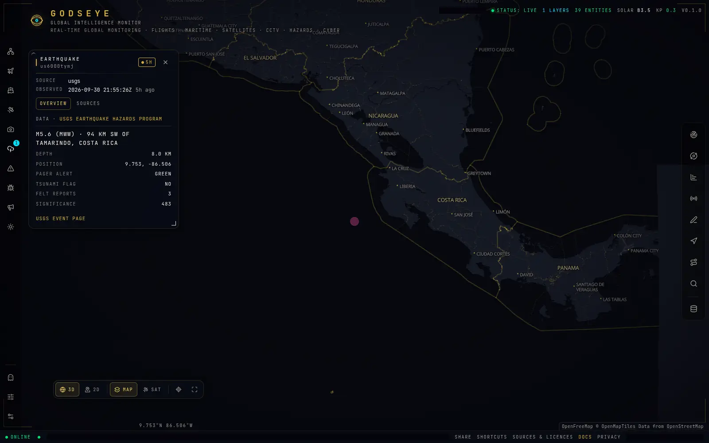
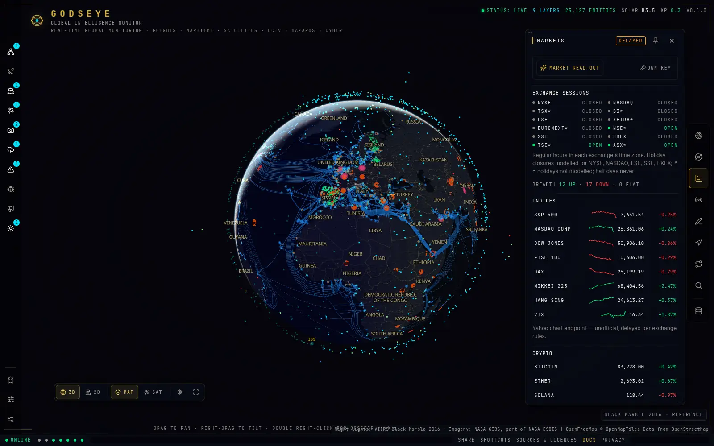
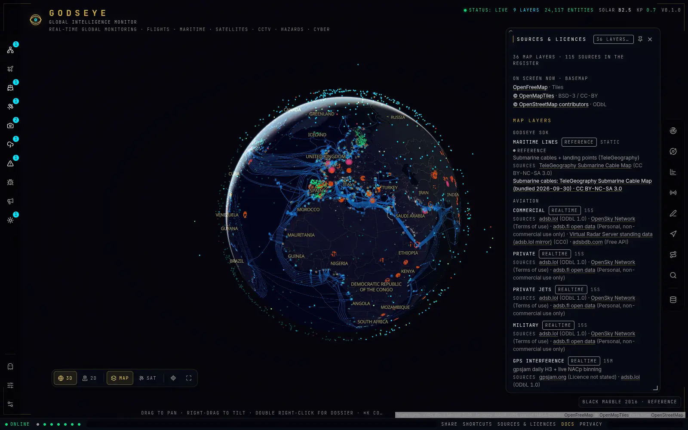

# GODSEYE

**GLOBAL INTELLIGENCE MONITOR** — an open-source, keyless, real-time "god's-eye" view of the planet on a
WebGL globe: aircraft, maritime, satellites, public traffic cameras, hazards, conflict and cyber
indicators, markets and live alerts, plus a Flight Path Planner for the route between any two airports.

It runs with **zero API keys**. Keys only unlock upgrades. Every number on screen comes from a named
source, with the time it was observed and how fresh it is.

- In the app: `/docs` (API reference), `/privacy` (what leaves the instance), `/cameras-notice` (camera
  policy and takedown).
- In this repository: [docs/API.md](docs/API.md) · [docs/ARCHITECTURE.md](docs/ARCHITECTURE.md) ·
  [docs/DATA_SOURCES.md](docs/DATA_SOURCES.md) · [.env.example](.env.example).

## Honest data, by construction

GODSEYE replicates the feature set of an existing MIT-licensed monitor (credited under Licence below) and
was built to answer the criticism that project received: synthetic data shown as live intelligence, docs that drifted
from the API, and weak security and licensing. The rules are enforced in code and tests, not just stated:

- **Nothing is fabricated.** No random, jittered, cloned or padded data (`Math.random` is a lint error in
  shipped code; retry-timing jitter in the HTTP client is the only exemption). Blocklist hits are drawn as **INDICATOR** points; attack arcs appear only when a source
  reports both ends. Static layers (nuclear sites, chokepoints, conflict zones, ports) are badged
  **REFERENCE**, never LIVE.
- **Observation time is not fetch time.** Responses carry `observedAt` and `fetchedAt` separately; LIVE
  only appears for data observed within its cadence. A source that fails shows **SOURCE OFFLINE** with
  its last-good time — the API answers `503 source_offline`, never an empty list pretending to be current.
- **Every aggregate response names its providers** with `{ok, count, ms, age_s}`.
- **A heuristic is called a heuristic.** Without a model key, summaries come from the deterministic
  ANALYST digest and say so; "AI" is used only for actual language-model output.
- **One catalogue, no drift.** `src/lib/api-catalog.ts` generates `/docs`, `docs/API.md`, the Privacy
  page's list of third parties and the per-route rate limits; tests fail when they disagree.

## Screenshots

Captured from a production build with live keyless feeds (software WebGL; see
[docs/screenshots](docs/screenshots/README.md) for the full set and how to re-capture).

| | |
|---|---|
|  |  |
|  |  |

## Quick start (no keys needed)

Requirements: Node.js ≥ 22.12 and pnpm 10 (via Corepack).

```sh
corepack enable
pnpm i
pnpm dev            # http://localhost:3000
```

`pnpm dev` and `pnpm build` first vendor the MapLibre worker into `public/maplibre/<version>/`.
`pnpm build && pnpm start` serves a production build. The three web fonts (Inter, JetBrains Mono,
Space Grotesk; OFL) come from `@fontsource` packages through `next/font/local`, so the build needs no
font download and the browser never contacts a font CDN.

## Docker

```sh
docker compose up -d                                  # app + Caddy on https://localhost (Caddy's internal CA)
GODSEYE_DOMAIN=monitor.example.org docker compose up -d   # automatic HTTPS for your domain
docker compose --profile redis up -d                  # add Redis (set REDIS_URL=redis://redis:6379 in .env)
```

The image (`Dockerfile`) is a multi-stage `node:22-alpine` build (base pinned by digest):
`pnpm install --frozen-lockfile`, `pnpm build`, then the standalone server with `.next/static` and
`public/`, running as uid 1001 without a login shell or package managers, with a `HEALTHCHECK` on
`/api/health`. No secrets are baked in: put keys in `.env` (read at run time by compose) or pass them as
environment variables. Compose runs every container with a read-only root filesystem,
`no-new-privileges` and all Linux capabilities dropped (Caddy keeps only `NET_BIND_SERVICE`; Redis runs
as its own user); the app writes only to the `snapshots` volume (feed snapshots survive restarts) and
two small tmpfs mounts. The app container is never published directly; Caddy (`Caddyfile`) terminates
TLS, overwrites `X-Forwarded-For` / `X-Real-IP`, caps request bodies (64 KB on `/api/ai/*`, 1 MB
elsewhere), compresses JSON and HTML with zstd/gzip, streams Server-Sent Events unbuffered and keeps no
access log. The Caddy and Redis images are pinned by digest too; refresh the digests with
`docker buildx imagetools inspect caddy:2-alpine` (or `redis:8-alpine`) when you update.

## Configuration

Every variable is optional; copy `.env.example` to `.env` and fill in only what you need.
`GET /api/health` shows which capabilities are on and, if not, why. Never put secrets in `NEXT_PUBLIC_*`
variables.

### Identity, licensing and deployment

| Variable | Effect |
|---|---|
| `GODSEYE_CONTACT` | Email or URL appended to the User-Agent sent to every upstream (default: this repo's issue tracker). Please set it on public instances. |
| `GODSEYE_DOMAIN` | Public hostname for the bundled Caddy in `docker compose` (automatic HTTPS). |
| `COMMERCIAL_DEPLOYMENT` | `true` turns off every non-commercial source (capabilities `nc_sources`, `openmeteo`, `cloudflare`, `deepstate`). |
| `NONCOMMERCIAL` | `true` enables DeepStateMap frontlines (`deepstate`; never with `COMMERCIAL_DEPLOYMENT`). Non-commercial use with attribution only; DeepState requires prior approval for commercial use of its API. |
| `TRUSTED_PLATFORM` | `cloudflare`, `vercel` or `akamai`: trust that edge's client-IP header. Leave empty behind your own proxy. |
| `TRUSTED_PROXY_HOPS` | Number of proxies appending to `X-Forwarded-For` (default 1: the rightmost entry is the client). |
| `TRUST_PROXY_HEADER` | Trust exactly one header your proxy overwrites, e.g. `x-real-ip`. |
| `HSTS_PRELOAD` | `true` adds `preload` to HSTS (commits the whole domain to HTTPS). |
| `SSE_MAX_DURATION_MS` | Close event streams after this many ms so capped hosts reconnect cleanly (Vercel default 280000). |
| `SSE_MAX_BUFFERED_BYTES` | Process-wide budget for bytes queued to slow event-stream clients (default 256 MB); past it the slowest clients are dropped. |
| `GODSEYE_DISABLE_POLLER` | `true` disables the background upstream poller (tests, static previews). |

### Caching and self-hosted engines

| Variable | Capability / effect |
|---|---|
| `REDIS_URL` | `redis`: shared snapshots, single-writer locks and rate limits across instances. |
| `SNAPSHOT_STORE` | Force `memory`, `filesystem` or `redis`. |
| `SNAPSHOT_DIR` | Filesystem snapshot store directory (survives restarts). |
| `SNAPSHOT_MEMORY_MAX_BYTES`, `SNAPSHOT_MAX_FILES`, `SNAPSHOT_MAX_DISK_BYTES` | Bounds for per-query cache entries in the memory (default 256 MB) and filesystem (default 20000 files, 1 GB) stores; feed snapshots are never evicted. |
| `PHOTON_URL`, `NOMINATIM_URL` | Self-hosted geocoders instead of the public demo servers. |
| `VALHALLA_URL`, `OSRM_URL` | Self-hosted routing engines. |
| `ARCGIS_ALLOWED_HOSTS` | Extra ArcGIS servers `/api/arcgis` may import from (exact hosts with an optional `:port` such as `:6443`, https only); ArcGIS Online hosted services (`services.arcgis.com`, `services[1-9].arcgis.com`, `services-eu1`/`services-ap1.arcgis.com`) and `*.arcgisonline.com` are built in. |

### Upgrades by capability

| Variable(s) | Capability | Unlocks |
|---|---|---|
| `ADSBLOL_REAPI=true` | `adsblol_reapi` | adsb.lol re-api (only from a feeder IP) |
| `OPENSKY_CLIENT_ID`, `OPENSKY_CLIENT_SECRET`, `OPENSKY_LICENSED=true` | `opensky` | OpenSky (requires a written licence for live products) |
| `ADSBFI_PERSONAL_USE=true` | `adsbfi` | adsb.fi open data (personal, non-commercial use only) |
| `FPDB_API_KEY` | `fpdb` | FlightPlanDatabase plans (flight simulation only) |
| `AIS_API_KEY` | `ais` | Live AIS vessels via a server-side AISStream relay |
| `TFL_APP_KEY` | `tfl` | TfL Unified API ("Powered by TfL Open Data") |
| `CCTV_LINK_OUT_ONLY` | — | Region keys or country codes whose cameras are shown as operator links only (no previews) |
| `CCTV_REMOVED_IDS` | — | Camera ids removed on request (report/remove button), comma-separated |
| `TRAFIKVERKET_KEY` | `trafikverket` | Trafikverket API (stills are keyless) |
| `CLOUDFLARE_API_TOKEN` | `cloudflare` | Cloudflare Radar outages and attack origins (CC BY-NC data) |
| `ABUSECH_AUTH_KEY` | `abusech` | abuse.ch APIs (bulk files stay keyless) |
| `NVD_API_KEY` | `nvd` | Higher NVD rate limit |
| `OTX_KEY` | `otx` | AlienVault OTX |
| `SDK_INGEST_KEY` | `sdk` | GODSEYE SDK entity ingest (fail-closed without a key) |
| `OPENSANCTIONS_KEY` | `opensanctions` | OpenSanctions API |
| `SCANNER_URL`, `SCANNER_KEY` | `scanner` | Optional allow-listed scanner backend (passive scan types) |
| `SCANNER_ALLOW_ACTIVE=true` | `scanner_active` | Operator opt-in for active scan types |
| `COINGECKO_DEMO_KEY` | `coingecko_demo` | CoinGecko demo key |
| `ANTHROPIC_API_KEY` | `anthropic` | Language-model briefings and overviews |
| `GEMINI_API_KEY_1` | `gemini` | Fallback analyst model |
| `OLLAMA_URL` | `ollama` | Operator-configured local model (visitors can never supply a URL) |
| `ANTHROPIC_MODEL`, `GEMINI_MODEL`, `OLLAMA_MODEL` | — | Optional model overrides; by default the newest suitable model from each provider's model list is used |
| `DISABLE_USER_AI_KEYS=true` | `ai_user_keys` | Refuse visitor-supplied keys (`x-ai-key` header, used once, never stored) |

Keyless licence gates that are on by default: `nc_sources` (TeleGeography cables, OpenSanctions bulk,
abuse.ch, ip-api, Shodan InternetDB) and `openmeteo` (Open-Meteo free tier); both are
off when `COMMERCIAL_DEPLOYMENT=true`.

## Deployment notes

- **Always put a reverse proxy in front, and make it overwrite `X-Forwarded-For`.** Rate limits are per
  route and per client IP; if clients can supply their own `X-Forwarded-For`, they choose their own
  bucket. Caddy: `header_up X-Forwarded-For {remote_host}` (as in `Caddyfile`); nginx:
  `proxy_set_header X-Forwarded-For $remote_addr;`. Never expose `next start` or `node server.js`
  directly: without a proxy that overwrites the header, every forged `X-Forwarded-For` value gets a
  fresh bucket, which in effect disables rate limiting (the server logs a warning at start-up when no
  trusted proxy is configured). Behind Cloudflare, Vercel or Akamai set `TRUSTED_PLATFORM` instead.
- **Streaming:** disable proxy buffering for `text/event-stream` (the app also sends
  `X-Accel-Buffering: no`) and keep read timeouts above the 15 s heartbeat.
- **Several instances:** set `REDIS_URL` so they share snapshots, the single-writer locks and the rate
  limits; otherwise each instance polls every upstream itself.
- **Vercel (secondary target):** function bodies are capped at 4.5 MB (bulk layers are compressed and
  split to stay under it), durations are capped (event streams close at `SSE_MAX_DURATION_MS`, 280 s by
  default there, and the browser reconnects), egress IPs are shared, so per-IP quotas such as CelesTrak
  and Nominatim behave worse, and the Hobby plan is non-commercial. Use one region and a Redis
  (for example Upstash) `REDIS_URL`.
- **Security headers** (CSP, HSTS, `X-Frame-Options`, `nosniff`, `Permissions-Policy`) are set by the
  app itself; see [docs/ARCHITECTURE.md](docs/ARCHITECTURE.md#accepted-trade-offs) for the trade-offs.

## Privacy and responsible use

- No accounts, no cookies, no analytics. Data APIs are called by the server, never with the visitor's IP
  address. Map tiles, official video embeds and some camera video load directly in the browser from the
  hosts listed on `/privacy`, and `/api/geo` sends the visitor's IP to a geolocation provider only after
  they click "centre on my region". `/privacy` also lists every third party that receives something a
  visitor typed, generated from the endpoint catalogue.
- The visitor is never geolocated automatically: "centre on my region" is an explicit click.
- OSINT tools are **passive and about infrastructure only** (domains, IPs, certificates, networks,
  vulnerabilities). There is no username, email, phone or identity search: sanctions-list screening and
  the entity graph cover listed or public entities only, never private individuals.
- Active scanning is available only if the operator connects a separate scanner backend; scans are
  allow-listed and **proxied through this server**, never run "from your browser". Scanning systems you
  are not authorised to test may be unlawful.
- Cameras are official public feeds for situational and traffic awareness: no recording, archiving, or
  face/plate recognition, a "Report / remove this camera" button on every feed, and a camera notice at
  `/cameras-notice`.
- Respect each provider's terms: the licence summary in [docs/DATA_SOURCES.md](docs/DATA_SOURCES.md)
  lists attribution duties and which sources are non-commercial.

## Contributing

```sh
pnpm lint          # ESLint 10, zero warnings
pnpm typecheck     # TypeScript strict
pnpm test          # Vitest (pnpm test:coverage enforces ≥ 80 % lines on src/lib, src/app/api, src/features/flight-paths)
pnpm build
pnpm e2e           # Playwright (starts the production server itself)
```

After changing the endpoint catalogue or a probe log, regenerate the generated docs (tests fail when they
are stale):

```sh
node --experimental-transform-types --import ./tools/ts-loader.mjs tools/gen-api-docs.ts
node --experimental-transform-types --import ./tools/ts-loader.mjs tools/compile-data-sources.ts
```

Probe every new upstream with `curl` and the GODSEYE User-Agent before wiring it, and record status,
latency, CORS, auth and licence in `docs/data-sources/<area>.md`. Project rules for contributors and
coding agents are in [CLAUDE.md](CLAUDE.md). CI runs all of the above plus `pnpm audit --prod` and
Lighthouse CI on every push and pull request, both on `ubuntu-24.04`: `/docs` and `/privacy` against
the contract thresholds (`pnpm lhci`, `lighthouserc.json`), and `/` against a separate software-GL
budget (`pnpm lhci:home`, `lighthouserc.home.json`), described in the next section. A GPU runner, if
you provide one, adds the measurement of `/` against the contract thresholds.

### Lighthouse on `/`

`/` is the WebGL globe. GitHub's standard runners have no GPU, so in CI Chromium draws the globe with
SwiftShader, a software rasteriser on the CPU. Measured there up to 2026-10-01 (desktop settings,
median of three runs): performance 0.53 to 0.55 (seven runs), total blocking time 4.3 to 9.0 s (four
runs; earlier runs 3.5 to 10 s), LCP within 2.5 s, CLS 0.006, accessibility 1. Rasterising the globe
on the CPU blocks the main thread for seconds, so total blocking time, 30 % of the performance score,
scores 0 there and the performance score cannot exceed 0.70: the contract targets for performance
and TBT are out of reach on that runner. They describe visitors with a GPU, which it cannot show.

CI therefore holds `/` to a separate, documented **software-GL budget**: performance ≥ 0.45 and
TBT ≤ 12000 ms, with accessibility, LCP and CLS at the contract values (`lighthouserc.home.json`,
check "Build + Lighthouse CI (/, software-GL budget)", run on every push and pull request, never
skipped). Same Chrome (the runner's preinstalled Google Chrome), SwiftShader flags and desktop
settings as the history above, three runs, assertions on the median run:

| Metric | `/` software-GL budget | Contract (§11) | Basis |
|---|---|---|---|
| Performance | performance ≥ 0.45 | ≥ 0.85 | Lowest CI median 0.53 minus 0.08 (four times the observed spread of 0.02). With TBT at 0 the score moves with FCP, speed index, LCP and CLS only: with the FCP, speed index and CLS of a build-sandbox run (0.4 s, 8.6 s, 0.006), LCP at the contract's 2.5 s gives 0.465. |
| Total blocking time | TBT ≤ 12000 ms | ≤ 300 ms | Highest CI value (10 s) plus 20 %. The performance score no longer sees TBT here, so this is the regression check for main-thread work. |
| Accessibility | = 1 | = 1 | Contract value. |
| Largest contentful paint | ≤ 2500 ms | ≤ 2500 ms | Contract value. |
| Cumulative layout shift | ≤ 0.1 | ≤ 0.1 | Contract value. |
| `godseye-map-globe-drawn` | score 1 in every run | | The run measured the globe (below). |

This budget catches regressions of the software-rendered globe. It does not show that `/` meets the
§11 performance and TBT targets, which assume a GPU; only the optional GPU job below measures that.
If the runner's hardware or Chrome changes the numbers for good, re-derive both budget values from the
new CI history with the same rule (lowest median minus 0.08, highest TBT plus 20 %) and update
`lighthouserc.home.json` and this table together; `tools/ops-config.test.ts` checks that they agree.

A page that fell back to "WEBGL2 REQUIRED" or "BASEMAP UNAVAILABLE" is much lighter than the globe:
in the build sandbox (2026-10-01, Chromium 141, these flags) the fallbacks scored performance 0.82 to
0.88 (0.86 on the median run of each) with 58 to 181 ms of total blocking time, against 0.52 to 0.57
and 3.4 to 15.8 s for the globe (six runs), so they would pass this budget, and even the contract's
performance and TBT targets, without earning it.
A globe without its basemap tiles also skips the work of drawing them. So every scored run
carries the in-run audit `godseye-map-globe-drawn` (`tools/lighthouse/home-config.mjs`), asserted on
every run, not on the median. In the page load being scored, after the measurement, it requires: no
fallback alert; the MapLibre canvas with a WebGL2 context (the renderer is reported, SwiftShader in
CI, not judged); `data-map-ready="true"`; a basemap state other than offline; the canvas alone,
screenshotted with every other element hidden, painted (at least 64 colours, no colour over 90 % of
it); and the MapLibre worker and at least one basemap vector tile loaded with HTTP 200. One run that
measured anything else fails the check. Locally: `pnpm build && pnpm lhci:home` (with Chrome or
Chromium installed; `CHROME_PATH` selects a binary).

### Optional: GPU runner for Lighthouse on `/`

The upgrade: on a hardware GPU, CI also measures `/` against the full contract thresholds
(performance ≥ 0.85, accessibility = 1, LCP ≤ 2.5 s, CLS ≤ 0.1, TBT ≤ 300 ms, median of three desktop
runs; job "Build + Lighthouse CI (/, GPU runner)", `lighthouserc.gpu.json`) and checks that every scored
run drew the globe on that GPU: the config adds the in-run audit `godseye-map-webgl-hardware`, asserted
on every run. Nothing needs it: while the repository variable `LIGHTHOUSE_GPU_RUNNER` is empty the job
is skipped (shown as skipped, never red, never queued), and `/` stays gated by the software-GL budget
above. Once the variable names a runner, the job:

1. runs on that runner for pushes and same-repository pull requests. A run from a fork goes to
   `ubuntu-24.04` instead and fails in its first step: the check is red ("not measured") within
   seconds, never green. When the variable names a label that no online runner carries (mistyped,
   runner offline, billing blocked), the job waits as Queued for up to 24 hours and then fails: the
   check stays pending, never green;
2. installs Playwright's pinned Chromium build, points `CHROME_PATH` at it and builds the app;
3. runs the pre-check `pnpm lhci:gpu:check` (`tools/gpu-renderer-check.ts`), a fast filter so that a
   runner without working hardware WebGL2 never spends minutes on Lighthouse. It launches the same
   Chromium binary with the `chromeFlags` of `lighthouserc.gpu.json` (a separate Playwright launch:
   Playwright's other automation flags remain and chrome-launcher's defaults are absent) and fails unless
   WebGL2 runs on a hardware renderer, on a blank canvas and on the map's own canvas at `/`. SwiftShader,
   llvmpipe, lavapipe, any "software" renderer, a context with a major performance caveat, WebGL not
   hardware-enabled in Chromium's own report, or no WebGL2 at all fail the job;
4. collects three Lighthouse runs of `/`, and refuses to start without a passing pre-check on record.
   Every run carries the in-run audit `godseye-map-webgl-hardware` (`tools/lighthouse/`): in the page load
   being scored, and in Lighthouse's own Chromium, it reads the WebGL2 renderer of the MapLibre canvas,
   whether a context that refuses a major performance caveat can be created, the browser's full version
   and Chromium's GPU feature status;
5. verifies every run (`pnpm lhci:gpu:verify`): the in-run audit passed with a hardware renderer, the
   MapLibre worker and at least one basemap vector tile loaded with HTTP 200, no console error mentions
   WebGL, the desktop settings applied, the browser is the pre-checked build, the number of runs is
   right, and the blank-canvas check still passes after the runs;
6. only then asserts the thresholds (`lhci assert`, with the in-run audit asserted on every run) and
   writes the reports. The job summary quotes, for each scored run, the renderer reported by the in-run
   audit next to that run's scores. The reports, `gpu-renderer.json` (pre-check) and `gpu-runs.json`
   (verification) are uploaded as the `lighthouse-gpu` artifact.

**Set the variable.** Settings → Secrets and variables → Actions → Variables → New repository variable:
name `LIGHTHOUSE_GPU_RUNNER`, value the runner's label (for example `gpu-t4-4core`) or a JSON array of
labels (for example `["self-hosted","linux","x64","godseye-gpu"]`). It is not a secret, and no keys are
needed. Deleting the variable (or leaving it empty) turns the job back into a skipped one.

**Fork pull requests (both options).** Under Settings → Actions → General → "Approval for running fork
pull request workflows from contributors", choose "Require approval for all external contributors". A
fork pull request runs its own copy of the workflow, so it can name the GPU runner's label in `runs-on`
directly and raise `timeout-minutes` to 360: the routing in `ci.yml` only keeps unmodified runs off the
GPU runner and is neither a cost guard nor a security boundary. On a GitHub-hosted GPU runner an
approved fork run is billed to the organisation (360 minutes is about $18.72), so read every change to
`.github/**` and `package.json` before approving one; on a self-hosted runner the pre-job hook below
refuses fork runs anyway. Never add a `pull_request_target` trigger. Dependabot pull requests come from
this repository and do receive repository variables (GitHub staff confirmed it in community discussion
44088, March 2023; the Dependabot docs only mention secrets), so every dependency update is measured on
the GPU runner, twice (its push and its pull request).

**Option A: GitHub-hosted GPU runner (recommended).** GPU runners are larger runners, which GitHub offers
only to organisations on GitHub Team (a paid per-user plan) or Enterprise Cloud, so a repository in a
personal account must first move into such an organisation (Settings → General → Transfer ownership).
Keep a payment method on the organisation (larger runners can take up to 10 minutes to become usable
after one is added) and give the Actions budget a non-zero amount, for example $20 a month with
"Stop usage when budget limit is reached": a $0 budget blocks larger runners, and the job then waits as
Queued. Then, as an organisation owner: organisation Settings → Actions → Runners → New runner → New
GitHub-hosted runner. Name it (the name becomes the label, for example `gpu-t4-4core`); platform Linux
x64; image: Partner tab, "NVIDIA GPU-Optimized Image for AI and HPC" (GitHub's docs list it as
NVIDIA GPU-Optimized VMI); size: GPU-powered tab (4 vCPU, one Tesla T4, 28 GB RAM, 16 GB VRAM, 176 GB SSD);
maximum concurrency 1; a dedicated runner group. Give that group access to this repository (Repository
access → Selected repositories) and allow public repositories, because runner groups serve private
repositories only by default. Billing is per job, rounded up to whole minutes (`linux_4_core_gpu`,
$0.052 per minute on 2026-10-01), not covered by included minutes and never free, public repositories
included. One run (build, pre-check, three Lighthouse runs, verification) takes roughly 8 to 15 minutes,
about $0.40 to $0.80, and a push to a branch with an open pull request runs it twice (push and
pull_request). References: [larger runners](https://docs.github.com/en/actions/reference/runners/larger-runners),
[runner pricing](https://docs.github.com/en/billing/reference/actions-runner-pricing).

**Option B: self-hosted GPU machine.** GitHub's guidance is that self-hosted runners
"should almost never be used for public repositories", because anyone can open a pull request, and a
fork's pull request runs its own copy of the workflow. If you still use one, run it as a just-in-time
(JIT) runner, which takes exactly one job and is then removed:

- prepare a disposable VM image with a hardware GPU, an unprivileged runner user and no other
  credentials, containing: the GPU driver with its Vulkan ICD (`vulkaninfo --summary` must list the GPU,
  not llvmpipe), `jq`, Chromium's system libraries (`sudo npx playwright@1.63.0 install-deps chromium`;
  the workflow never runs `sudo` on a self-hosted runner), the
  [runner application](https://github.com/actions/runner/releases), and the pre-job hook below saved
  outside the runner directory, for example as `/opt/godseye-runner-hooks/job-started.sh` (executable,
  owned by root) and named in the runner's `.env` file:
  `ACTIONS_RUNNER_HOOK_JOB_STARTED=/opt/godseye-runner-hooks/job-started.sh`. The runner executes the
  hook before every job; a non-zero exit fails the job before any step runs, and a fork cannot edit a
  file on your machine;
- run a controller on the host, outside every runner VM. It holds the only admin credential: a
  fine-grained personal access token limited to this repository with the repository permission
  "Administration: Read and write", never copied into a VM. For each job it (1) starts a fresh VM from
  the clean image, (2) requests a JIT runner configuration with the call below, (3) starts
  `./run.sh --jitconfig "<encoded_jit_config>"` in that VM as the runner user, and (4) destroys the VM
  when `run.sh` exits, then starts over. GitHub assigns one job to that runner and removes it afterwards.
  While no matching runner is online the `/` check stays pending ("Waiting for a runner") for up to
  24 hours and then fails;
- the JIT call lists `self-hosted`, `linux` and `x64` next to `godseye-gpu`, as GitHub's own example
  does, because its `labels` field is documented only as the labels to add;
- before pushing a fork's change to a branch of this repository (which runs it on the GPU host), review
  the whole diff, including `pnpm-lock.yaml`, `next.config.ts`, `tools/**` and `src/**`, not only
  `.github/**` and `package.json`: the job installs, builds, runs and serves that tree.

```sh
# On the controller host (never inside a runner VM): one just-in-time runner configuration.
curl -sS --fail-with-body -X POST \
  -H "Accept: application/vnd.github+json" \
  -H "Authorization: Bearer $GODSEYE_RUNNER_ADMIN_TOKEN" \
  -H "X-GitHub-Api-Version: 2022-11-28" \
  https://api.github.com/repos/awne8886/godseye/actions/runners/generate-jitconfig \
  -d "{\"name\":\"godseye-gpu-$(date -u +%Y%m%dT%H%M%SZ)\",\"runner_group_id\":1,\"labels\":[\"self-hosted\",\"linux\",\"x64\",\"godseye-gpu\"]}" \
  | jq -r .encoded_jit_config
```

```sh
#!/bin/sh
# GODSEYE GPU runner pre-job hook: admit pushes and pull requests from this repository only.
set -eu
case "${GITHUB_EVENT_NAME:-}" in
  push) exit 0 ;;
  pull_request)
    head=$(jq -r '.pull_request.head.repo.full_name // empty' "$GITHUB_EVENT_PATH")
    if [ -n "$head" ] && [ "$head" = "${GITHUB_REPOSITORY:-}" ]; then exit 0; fi
    ;;
esac
echo "GODSEYE GPU runner: refusing a ${GITHUB_EVENT_NAME:-unknown} job from ${GITHUB_REPOSITORY:-unknown}: only pushes and same-repository pull requests run here" >&2
exit 1
```

**Branch protection.** In the ruleset for the default branch, require the two Lighthouse checks that
run on every push and pull request, "Build + Lighthouse CI (/docs, /privacy)" and
"Build + Lighthouse CI (/, software-GL budget)", and choose GitHub Actions as their source. Require
"Build + Lighthouse CI (/, GPU runner)" as well only once a GPU runner exists and the variable names it:
while the variable is empty that job is skipped, and GitHub counts a skipped job as passing a required
check, so requiring it then adds nothing. If the former single check "Build + Lighthouse CI" is still
required, replace it, or merges wait for it forever. With the variable set, a pull request from a fork
shows the GPU check red ("not measured") by design, and that failed check stays on the pull request. To
measure it, a maintainer reviews the change, pushes its head unchanged to a branch of this repository
(`git fetch origin pull/<number>/head && git push origin FETCH_HEAD:refs/heads/pr-<number>`), and merges
through a pull request opened from `pr-<number>`.

**When the renderer check fails on a GPU machine,** the job summary, `gpu-renderer.json` and
`gpu-runs.json` show what Chromium got, and the "GPU diagnostics" step lists the Vulkan ICD manifests.
Without a Vulkan ICD for the GPU, install the driver's user-space GL/Vulkan package for the same driver
version (on Ubuntu, `libnvidia-gl-<driver major>`, the major version that `nvidia-smi` prints). Nothing
can be preinstalled on a GitHub-hosted runner, so there it has to be a workflow step before the
pre-check, guarded by `if: runner.environment == 'github-hosted'` (the only place this workflow may use
`sudo`): `sudo apt-get install -y libnvidia-gl-<driver major>`. Chromium's
[GPU-in-headless notes](https://chromium.googlesource.com/chromium/src/+/main/docs/gpu/using-gpu-hardware-in-headless-chrome.md)
and [server-side GPU notes](https://chromium.googlesource.com/chromium/src/+/main/docs/gpu/server-side-headless-linux-chrome-with-gpus.md)
point to the [Tesla T4 guide](https://github.com/jasonmayes/headless-chrome-nvidia-t4-gpu-support) these
flags and packages come from. If Vulkan cannot work on that machine, ANGLE's EGL backend is the alternative: replace
`--use-angle=vulkan --enable-features=Vulkan --disable-vulkan-surface` with
`--use-gl=angle --use-angle=gl-egl` in `lighthouserc.gpu.json`; the pre-check and the in-run audit still
gate it. Never add SwiftShader flags to `lighthouserc.gpu.json` or loosen its thresholds: a red `/` on a
real GPU is an application performance problem to fix.

**Locally,** on a machine with a GPU, with the Chromium build CI uses (a branded Google Chrome applies
different field-trial settings):

```sh
pnpm exec playwright install --no-shell chromium && pnpm build && \
  CHROME_PATH="$(node -p "require('@playwright/test').chromium.executablePath()")" pnpm lhci:gpu
```

## Credits and licence

GODSEYE is released under the [MIT licence](LICENSE). It is an independent project that replicates the
features of OSIRIS — **OSIRIS © 2026 simplifaisoul, MIT licence** — and reuses some of its data tables and
behaviours with attribution; the NOTICE section of [LICENSE](LICENSE) lists files substantially derived
from it. GODSEYE does not use the OSIRIS name, logo, links or promotions. World Monitor and Orodruin
(AGPL) were studied for ideas only; no code was copied from them.

Map data © OpenStreetMap contributors (ODbL), tiles by OpenFreeMap; satellite imagery: Esri, Vantor,
Earthstar Geographics, and the GIS User Community; night lights and imagery courtesy of NASA GIBS. Fonts: Inter, JetBrains Mono and Space Grotesk (SIL Open
Font License 1.1), bundled from @fontsource. Every
other source and its licence is listed in [docs/DATA_SOURCES.md](docs/DATA_SOURCES.md) and in the in-app
attribution panel.
